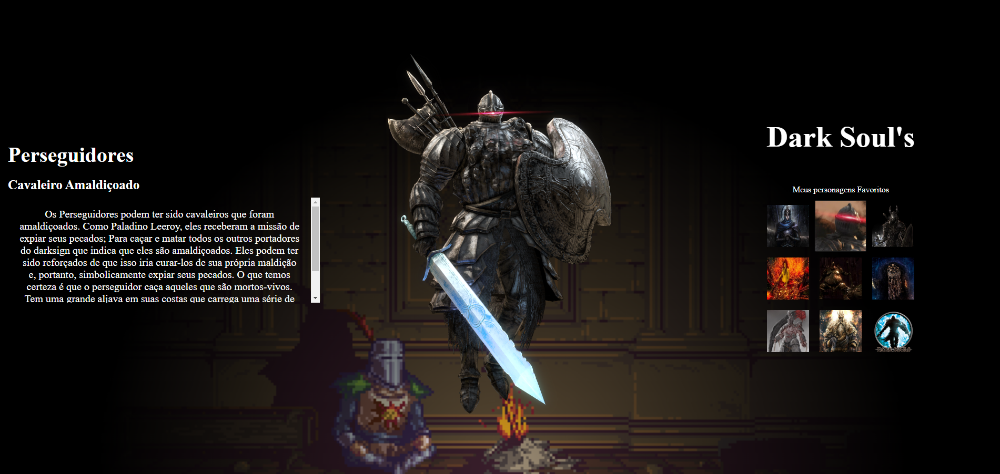
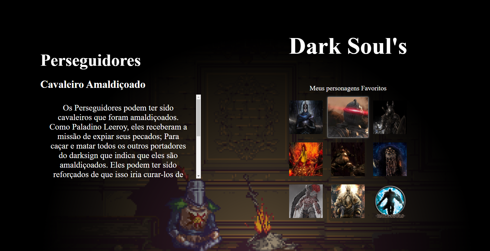
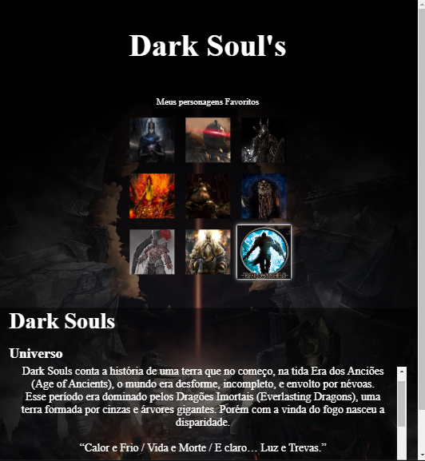
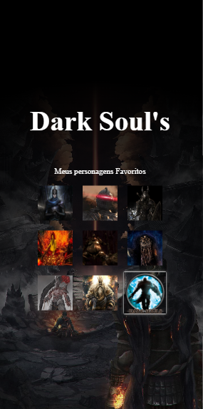

# DevQuest - JavaScript Intermediário
## Quest #Pessoal
### [Deploy](https://josuecosta2023.github.io/darkSoulsPersonSelected/)
* Baseado no projeto MAPA DEV WEEK, do curso Devquest.
* Aplicação de todos os conceitos apresentados em aula.

# Desafio: Lista de seleção de personagem
## Objetivos:
* Criar uma lista de personagens e tambem uma breve biografia do personagem.
* Conforme passar o Mouse por cima de um personagem, deverá ser apresentada uma ilustração de corpo todo do personagem e também mudar a biografia conforme o personagem.

## Maior dificuldade:
* Criar a responsividade da página
* Conseguir os dados dos personagens para o projeto.

## O que aprendi?
* Neste projeto aprofundei no atributo "DATA-" do HTML, entendi seu funcionamento e o utilizei para inserir os dados de nomes, titulos e biografia de cada personagem de minha lista.

### Conceitos não executados
* Não vi necessidade de utilizar IF's neste projeto.

### Screenshots
* Desktop
** 

* Notebook
** 

* Tablet
** 

* Mobile
** 

# Author
### Josué Ocanha Costa
#### FrontEnd Developer
#### Redes Sociais

- Linkedin - [JosueOcanhaCosta](https://www.linkedin.com/in/josue-ocanha-costa/)
- Github - [JosueCosta2023](https://github.com/JosueCosta2023)
- Twitter - [@JosueOcanhaCosta](https://twitter.com/josue_ocanha)
- Facebook - [JosueCosta](https://www.facebook.com/JosueOcanhaCosta2023)
- Whatsapp - [Josue2023](https://wa.me/5565996408371?text=Ol%C3%A1%2C+encontrei+seu+whatsapp+no+Github.+Gostaria+de+falar+sobre+seus+projetos.)

# "Vida longa e próspera." 🖖🖖🖖
